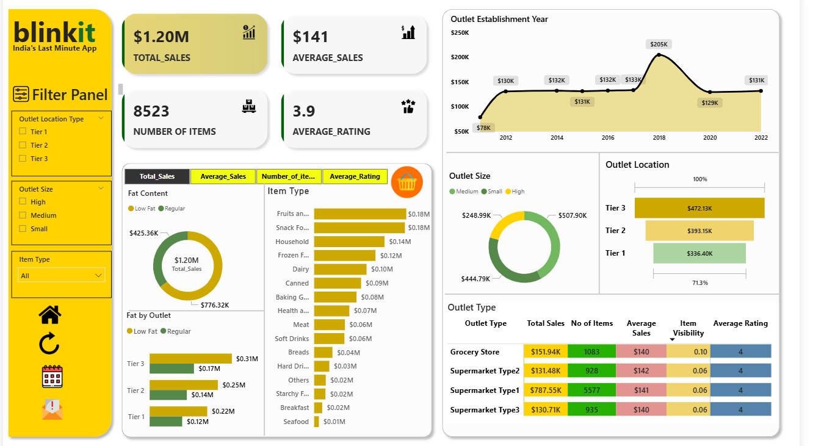

# 📊  Blinkit-business-intelligence (Power BI)

A fully interactive **Power BI dashboard** built to analyze sales performance, customer behavior, and product trends for BlinkIT’s grocery business.  
This project demonstrates strong skills in **data cleaning, data modeling, DAX, and dashboard design**, making it ideal for data analytics portfolios and job applications.

---

## 🔥 Why This Project Matters

Retail businesses depend heavily on understanding **which products sell**, **which stores perform best**, and **how customer choices vary**.  
This dashboard provides clear, actionable insights that help optimize:

- Product assortment  
- Pricing strategies  
- Store performance  
- Sales forecasting decisions  

---

## 📸 Dashboard Preview

---

## 🌟 Key Highlights

### ✔ High-Impact KPIs
- Total Sales  
- Average Sales Price  
- Total Transactions  
- Item Visibility Score  

### ✔ Visual Insights
- **Sales by Outlet Type**
- **Item Type Sales Contribution**
- **Fat Content Sales Comparison**
- **Outlet Tier Performance**
- **Product Category Trends**

### ✔ Professional Dashboard Design
- Clean layout with consistent color theme  
- Interactive slicers for Item Type, Outlet Type, and Visibility  
- Smart DAX measures for accurate KPI calculations  

---

## 📁 Dataset

- **BlinkIT Grocery Dataset (Excel format)**
- 8,500+ rows of item-level retail data  
- Includes:
  - Item Type, Weight, Fat Content  
  - Outlet Location & Size  
  - Sales & Visibility  
- Provided Power BI File: `blinkit.pbix`  
- Supporting images stored in: `/dataset/images/`

---

## 🛠 Tools & Skills Demonstrated

- **Power BI Desktop**
- **Data Cleaning & Preprocessing**
- **Data Modeling (Star Schema)**
- **DAX Calculations**
- **Interactive Dashboard Design**
- **Excel Data Handling**

---

## 🚀 How to Run the Project

1. Clone or download this repository  
2. Open `blinkit.pbix` in Power BI Desktop  
3. Refresh dataset if required  
4. Interact with slicers & visuals to explore insights  

---

## 💡 Insights You Can Derive

- Which **outlet types** generate the highest revenue  
- Contribution of each **item type** to total sales  
- The impact of **fat content** on customer demand  
- How **store tier & size** influence performance  
- Which product categories should be prioritized  

---

## 🎯 Project Objective

To showcase end-to-end analytics skills by building a complete Power BI solution—from raw dataset to a polished, interactive dashboard that supports business decision-making.

---

## 🧩 Ideal For

- Data Analyst Portfolio  
- Power BI Practice Projects  
- Dashboard Design Demonstrations  
- Interview Showcases  

---

## 🤝 Contributions

Suggestions and improvements are welcome.  
Feel free to open issues or submit PRs.

---

## 📬 Contact

If you’d like help creating dashboards or analytics projects, feel free to reach out!

---
